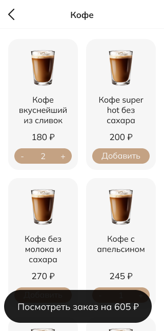

# SloyBot

## Overview

Course project about [Telegram Bot](https://t.me/WebAppFotTestBot) with web app personal for [Sloy Cafe](https://sloy.pro). 
The bot includes the ability to create an order by a certain time, pay for them online, track the status and view the order history.
The bot is integrated with the Sloy Cafe's CRM system and the [YooKassa](https://yookassa.ru) payment system.

<div style="display: flex; align-items: flex-start;">
  
  
</div>

## Project Structure and Architecture
The project consists of a front-end built with JavaScript, HTML and CSS, and a back-end developed using Java with Spring and a PostgreSQL database. 
It includes a swagger specification to generate the blank server.

### Front-end:
The frontend consists of a Telegram Bot and [Mini Apps](https://core.telegram.org/bots/webapps) connected to the bot. Mini Apps provide the high quality user interface.

<b>Telegram bot</b> was developed using Python.

<b>Mini apps</b> were developed using JavaScript, HTML and CSS.

### Back-end:
Back-end consists of a Java REST API built using the Spring framework. The API includes the following components:

Controller: Handles incoming requests from the front-end and delegates the logic to the appropriate service.

Service: Implements the business logic, such as creating orders, processing payments, and retrieving order history.

Repository: Interacts with the PostgreSQL database to store and retrieve data. 

The back-end includes integrations with the [iiko CRM](https://iiko.ru) system and the [YooKassa](https://yookassa.ru) payment system.

## Installation and Setup
### For user:
Just click on a link [SloyBot](https://t.me/WebAppFotTestBot).

### Front-end:

1. Clone the repository.
2. Go to the file `TelegramBot/Telegram bot/New order webapp/URL_storage_example.js` and open it.
3. Replace string `your_main_url` with your real host name.
4. Rename file `URL_storage_example.js` into `URL_storage.js`
5. Push all files from folder `New order webapp` to hosting. For example, you can use [GitHub](https://github.com) plus [Vercel](https://vercel.com) for it.
6. Repeat steps 2–5 with folder `Show orders webapp`.
7. Create Telegram Bot using [BotFather](https://t.me/BotFather).
8. Go to the file `TelegramBot/Telegram bot/Bot/.env.example` and open it.
9. Replace string `your_bot_token` with your real bot token (token was created in step 7).
10. Replace strings `user_url`, `ready_order_for_server_url`, `order_status_url` with your real URLs.
11. Replace strings `user_order_web_app_url`, `new_order_web_app_url` with your real hosting URLs (they were created in steps 5 and 6).
12. Rename file `.env.example` into `.env`.
13. Go to folder `TelegramBot/Telegram bot` and create Docker image using `Dockerfile`.
14. Push created Docker image to your host, for example, using [Docker Hub](https://hub.docker.com), and run it.


### Back-end:

1. Clone the repository.
   
2. Create JAR File of project.
  
3. Create a Docker image of the server:
```
docker build -t sloy-order:latest .
```
4. Create and run a PostgreSQL database Docker container on the host, and add a database named "sloy_db":
```
docker run --name postgres -e POSTGRES_PASSWORD=1234 -p 5432:5432 -d postgres
docker exec -it postgres psql -U postgres
CREATE DATABASE sloy_db;
\q
```

5. Set up a domain and SSL certificate for the server, so that Telegram can send requests to the server, for example, using [Certbot](https://certbot.eff.org).

6. Transfer the Docker image of server to your host, for example, using [Docker Hub](https://hub.docker.com), and run it:
```
docker run -t -i -d -p 80:80 -v /etc/letsencrypt/live/YOURDOMEN:/etc/letsencrypt/live/YOURDOMEN YOURNAME/sloy-order
```
